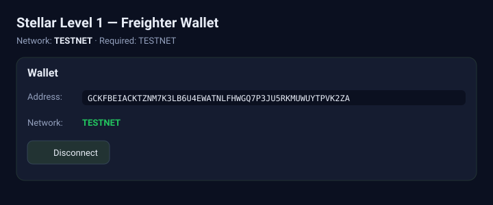
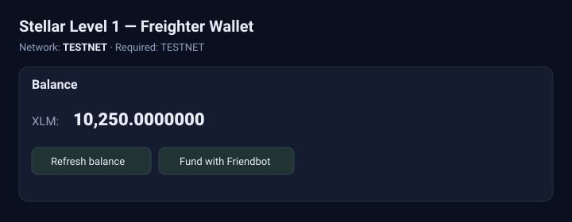
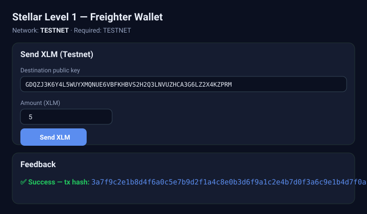
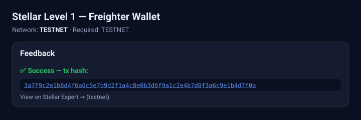

# Stellar Level 1 — Freighter Wallet Frontend

## Project description

This is a reference web frontend for a **Stellar Level 1** project. It connects to the
**Freighter** wallet on the **Stellar Testnet**, lets the user connect/disconnect their
wallet, fetches and displays the connected wallet's **XLM balance**, and sends an **XLM
payment on Testnet** — showing clear **success/failure feedback** with the transaction hash.

It is built with **Vite + React + TypeScript**, using
[`@stellar/freighter-api`](https://developers.stellar.org/docs/build/freighter) for wallet
integration and [`stellar-sdk`](https://developers.stellar.org/docs/data-and-tools/stellar-sdk)
for Horizon/balance/transaction logic.

### Level 1 requirements covered

1. **Wallet Setup** — Freighter wallet, Stellar **Testnet** (`src/stellar.ts`)
2. **Wallet Connection** — `Connect Freighter` (`requestAccess`) + `Disconnect` (`src/wallet.ts`)
3. **Balance Handling** — fetch the connected wallet's **XLM balance** and display it in the UI
4. **Transaction Flow** — send **XLM on Testnet** and show **success/failure** + **transaction hash**
5. **Development Standards** — clean component UI (`src/App.tsx`), wallet layer (`src/wallet.ts`),
   balance + transaction logic (`src/stellar.ts`), and error handling throughout

## Setup instructions (run locally)

### Prerequisites

- **Node.js 18+** and npm
- The **Freighter** browser extension — install from https://www.freighter.app/
- In Freighter, set the network to **Testnet** (and create/fund a testnet account)

### Install & run

```bash
# from this frontend directory
npm install
npm run dev      # starts Vite dev server at http://localhost:5173
```

Open http://localhost:5173 in a browser that has the **Freighter** extension installed and set
to **Testnet**.

- Click **Connect Freighter** and approve access.
- Click **Fund with Friendbot** to top up your testnet account with XLM.
- Click **Refresh balance** to fetch your XLM balance.
- Enter a destination public key and an amount, then click **Send XLM** to submit a Testnet
  payment. The result (success + **transaction hash**, or an error message) is shown in the
  **Feedback** section.

### Build

```bash
npm run build    # type-check + production build -> dist/
npm run preview  # preview the production build
```

## Screenshots

> The screenshots below are UI mockups of the app states. Capture real screenshots from the
> running app and drop them into `docs/screenshots/` (same filenames) to replace them.

### 1. Wallet connected state


### 2. Balance displayed


### 3. Successful Testnet transaction


### 4. Transaction result shown to the user


## Project structure

```
.
├── index.html
├── package.json
├── vite.config.ts
├── tsconfig.json
├── src
│   ├── main.tsx        # React entry
│   ├── App.tsx         # UI: connect/disconnect, balance, send XLM, feedback
│   ├── wallet.ts       # Freighter wallet integration (connect/disconnect/sign)
│   ├── stellar.ts      # Testnet config, balance fetch, build + submit XLM payment
│   └── styles.css      # styling
└── docs/screenshots    # screenshots of the required states
```
